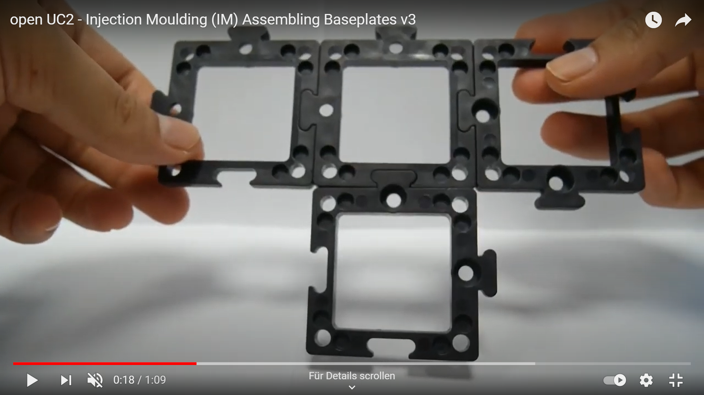
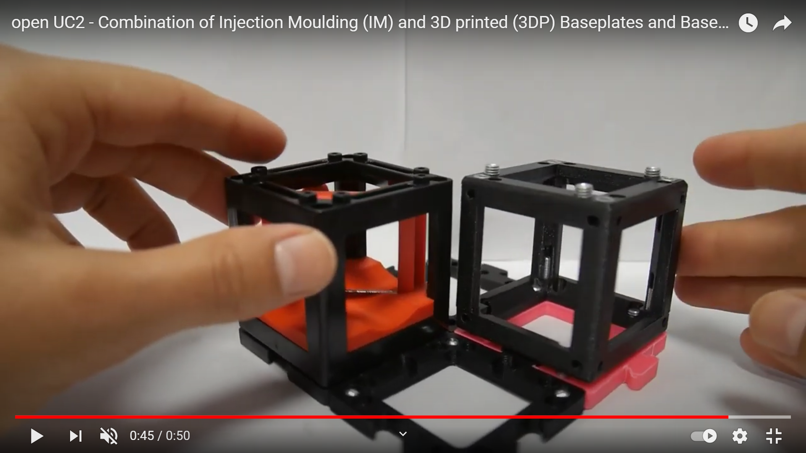

# Baseplate
This is the repository for the design of the baseplates. It is possible to use both injection-moulded (IM) and 3D-printed (3DP) baseplates.

To acquire the STL-files use the [UC2-Configurator](https://uc2configurator.netlify.app/). The files themselves are in the [RAW](../RAW/STL) folder.

## Purpose
Baseplates serve as a spine of any setup you build using the cubes. The basic unit is a puzzle piece.

The puzzle pieces can be arbitrarily combined into a baseplate of a desired size and shape. For better stability, the baseplate can be screwed to a Thorlabs breadboard, optical table or a wooden board. An example of a 'flat' setup is the light sheet microscope.

The baseplates can be also concatenated in third dimension,  being build in a "sandwich"-like structure. An example of a 'sandwich' setup is the incubator microscope.

#### Watch the Baseplate Assembly video to see how it works!

# Parts
The baseplate puzzles are produced using injection moulding (IM) but it is also possible to 3D print (3DP) them. The IM and 3DP puzzles are compatible.  
However, the size of the 3DP puzzles may vary between different printers and filaments. It is therefore advisable to calibrate the baseplate with your printer. Find the details in the [3D printing](./3DP_Baseplate) section.

Find out more about combining the IM and 3DP cubes in the [Modular Developer Kit](../../MDK).

##  [3D printing](./3DP_Baseplate)

###  Additional parts
* Check out the [RESOURCES](../../TUTORIALS/RESOURCES) for more information!
* Ballmagnets (four magnets per baseplate unit) - 5 mm diameter [🢂](https://www.magnetmax.de/Neodym-Kugelmagnete/Magnetkugel-Kugelmagnet-O-5-0-mm-Neodym-vernickelt-N40-haelt-400-g::158.html)

##  Assembly
* When using only the **IM** cubes with your baseplates, you don't need any further assembly - just build a baseplate of any shape you like.
* When using also the **3DP** cubes or some special modules, you will need to have magnets in the baseplate - follow the image tutorial.  

### Assembly Video Tutorial

### Assembly Tutorial with images

1. For each baseplate puzzle you need four 5 mm ball magnets.

2. Using pliers press the magnets into the holes in the corners of the baseplate puzzle.

3. Done - all magnets are inserted.

4. Now build a baseplate of any shape you need.

#### Combine IM and 3DP baseplates and Cubes

Where next?      
Return to the [TUTORIALS](../../TUTORIALS) if that's where you started
