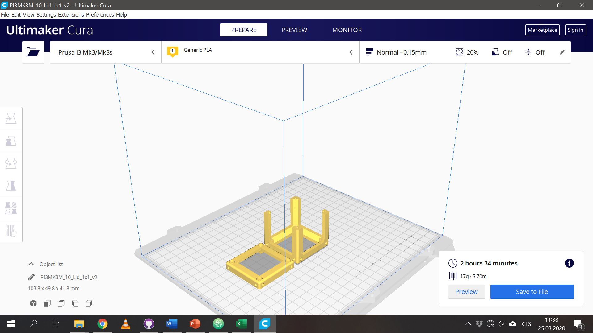

# BASE CUBE - 3D printing
([TUT01 of TUTORIALS](../../../TUTORIALS))

If you decided to use the 3D-printed Cube and not the injection moulded Cube, here is some useful information :-)

## Parts

### 3D printing parts
The Cube consists of the following components:

* **The Cube Body** where all the functions (i.e. Mirrors, LED's etc.) find their place - inserts that define the function of the cube are placed in the body before closing the lid ([Cube-BASE](UC2_v3_10_Cube_1x1_v3.stl))
* **The Lid** that closes the cube. It is attached by four M3 screws.  ([Cube-LID](UC2_v3_10_Lid_1x1_v3.stl))

The `.stl` files can be directly printed using off-the-shelf 3D printer.

An archive with all the files including the baseplate can be found [here](V3.zip).

### Additional parts
* Check out the [RESOURCES](../../../TUTORIALS/RESOURCES) for more information!
* 4× DIN912 M3×12 screws (galvanized steel) [🢂](https://eshop.wuerth.de/Zylinderschraube-mit-Innensechskant-SHR-ZYL-ISO4762-88-IS25-A2K-M3X12/00843%20%2012.sku/de/DE/EUR/)
* 4× DIN912 M3×8 screws (galvanized steel) - or use 8× M3×12
* 6× ISO4026 M5×8 screws [🢂](https://eshop.wuerth.de/Produktkategorien/ISO-4026-Stahl-45H-verzinkt/14013511052004.cyid/1401.cgid/de/DE/EUR/?CatalogCategoryRef=14013511052004%40WuerthGroup-Wuerth-1401&SelectedFilterAttribut=%255B%257B%2522name%2522%253A%2522AT_ThreadTypeXNominalDiameter%2522%252C%2522value%2522%253A%255B%2522M5%2522%255D%252C%2522title%2522%253A%2522Gewindeart%2520x%2520Nenndurchmesser%2522%257D%252C%257B%2522name%2522%253A%2522AT_Length%2522%252C%2522value%2522%253A%255B%25228%2520mm%2522%255D%252C%2522title%2522%253A%2522L%25C3%25A4nge%2522%257D%255D)

## 3D Printing

For general advice on 3D printing, have a look in the [TUTORIALS](../../../TUTORIALS#3d-printing).

### 3D printer settings

* Quality: Normal, 0,15 mm layer height
* Support: None
* Infill: 20%
* Adhesion: None if possible, otherwise brim
* Material: PLA/ABS/other
* Printing time: ~3:40 h

1. Download both .stl files - `UC2_v3_10_Cube_1x1_v3.stl` and `UC2_v3_10_Lid_1x1_v3.stl` or download and extract the `V3.zip`.
1. Place the files in your slicer and use the above settings. Leave the rest of the settings as default or based on the experience you have with your printer.
1. Slice it, save it, print it!
1. Next: [🢂 Assembly](../#assembly-video-tutorial)

### Video Tutorial
A quick printing tutorial can be found here (Note: the Video shows a UC2_v2 cube):

## Confusion about versions

The current version of the UC2 system is called v3. We're trying hard to update the APPlications so that everything is based on the new design, but it's a lot of files and there are probably still some forgotten v0 and v2 parts.

If you're unsure, check out the [Modular Developer Kit](../../../MDK) - there you find a general definition of the shape and size of the inserts which is up to date!

The outer cube dimensions stayed the same, but the inserts changed a lot!

[HERE (v0)](V0.zip) and [HERE (v2)](V2.zip) you find the old cube - just as a reference!

## Participation
If you need further assistance please file an issue. Thank you :-)
