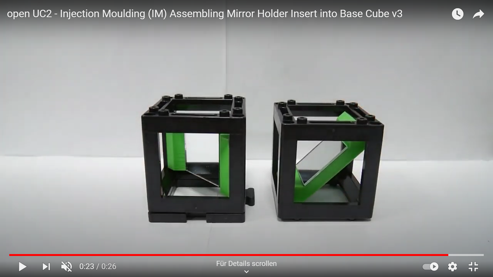

# Mirror Holder Cube
This is the repository for the Adjustable Mirror Holder Cube.

To acquire the STL-files use the [UC2-Configurator](https://uc2configurator.netlify.app/). The files themselves are in the [RAW](../RAW/STL) folder. The module can be built using injection-moulded (IM) or 3D-printed (3DP) cubes.

## Purpose
It adapts a 30×30 mm ² fold-mirror to the UC2 system. Alternatively, we also have a design for a 1-inch mirror holder.

Due to limited space, we need to fold the beam using a mirror. This is done by reflecting the incoming light under an angle of 45°. It follows in a change of the optical axis by 90°

### Properties
* design is derived from the base-cube
* the adapter holds a 30×30 mm ² toy-mirror or a 1 inch circular mirror (e.g. Thorlabs part) at 45 degrees in a UC2 base cube
* the here used mirror has the following parameters:
	* Diameter: 25,4mm
	* Reflectance
	* Surface Flatness: (Peak to Valley) λ/10 @ 633 nm
	* Substrate Fused: Silica
	* Thickness: 6.0 mm (0.24")

## Parts
The [Bill of Materials](https://docs.google.com/spreadsheets/d/1U1MndGKRCs0LKE5W8VGreCv9DJbQVQv7O6kgLlB6ZmE/edit?usp=sharing) is always the most up-to-date version!

###  3D printing parts
* No support needed in all designs
* Carefully remove all support structures (if applicable)

The Cube consists of the following components.

#### Default:
* **IM Cube** which houses the insert and adapts it into a UC2 setup.
* **The Mirror Insert (30×30 mirror)** which holds a 30x30mm Mirror from Amazon and adapts it to the base cube ([20_Cube_Insert_Mirror_Holder_wLogo_v3.stl](../RAW/STL))

#### Alternatives:
* **3DP Cube** which will be screwed to the Lid. Here all the functions (i.e. Mirrors, LED's etc.) find their place ([10_Cube_1x1_v3.stl](../RAW/STL)) and **3DP Lid** which closes the Cube ([10_Lid_1x1_v3.stl](../RAW/STL)) - find the details in [ASSEMBLY_CUBE_Base](../ASSEMBLY_CUBE_Base)
* **The Mirror Insert (Thorlabs mirror)** which holds a 1-inch Mirror from Thorlabs and adapts it to the base cube ([20_Cube_Insert_Mirror_Holder_Thorlabs_v3.stl](../RAW/STL))

###  Additional parts
* Check out the [RESOURCES](../../TUTORIALS/RESOURCES) for more information!
* 1× 30×30 Mirror from Amazon [🢂](https://www.amazon.de/Rayher-14548606-Spiegelmosaik-selbstklebend-SB-Btl/dp/B008KJ8438/ref=pd_bxgy_201_img_3/258-8761405-4543762?_encoding=UTF8&pd_rd_i=B008KJ8438&pd_rd_r=80fd534c-997b-4a19-b91a-9bf38dbf4ade&pd_rd_w=4DEXV&pd_rd_wg=7SLRE&pf_rd_p=98c98f04-e797-4e4b-a352-48f7266a41af&pf_rd_r=N95R9S45MNSYNQX2BAJE&psc=1&refRID=N95R9S45MNSYNQX2BAJE)
* or 1× Thorlabs PF10-03-P01 - Protected Silver Mirror [🢂](https://www.thorlabs.com/newgrouppage9.cfm?objectgroup_id=903)

##  Assembly
* Add the mirror to the Insert
* Add the insert to the Cube
* Close the cube accordingly (IM/3DP)
* Done!

### Assembly Video Tutorial
:grey_exclamation: This tutorial shows a UC2_v2 cube but the assembly of the insert is still the same. For assembly of the cube (IM/3DP) check the [ASSEMBLY_CUBE_Base](../ASSEMBLY_CUBE_Base).

### Tutorial with images (30×30 mm² mirror)
1. All parts for this model

2. Peel off the foil and stick the mirror to the insert.

3. You need to decide on the orientation of the insert - this is important because the cube cannot attach to the baseplate of every side. Do you want your mirror to look at each other like in the left picture or in the right one? This depends on which setup are you building - check the instructions there.

4. Mirrror looking through the side: Place the insert inside the cube and close it - done!

5. Mirror looking up (down): Place the insert inside the cube and hold it on one side. Slowly close the cube, making sure the insert is fitting to the two edges diagonally. Close it - done!

## Safety
Don't touch the mirror surface!
